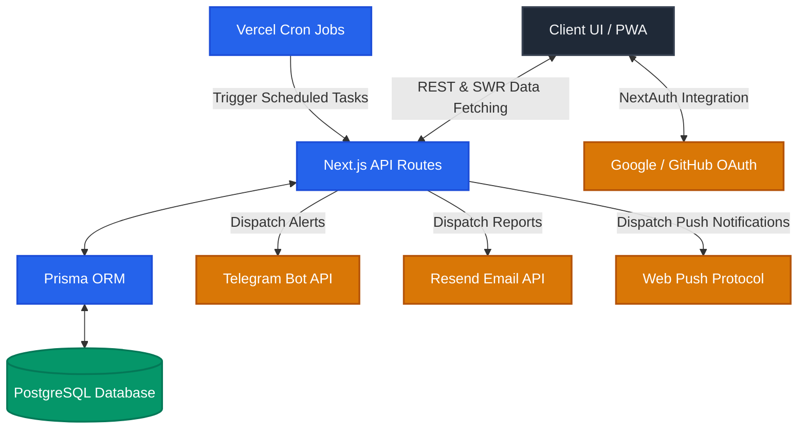
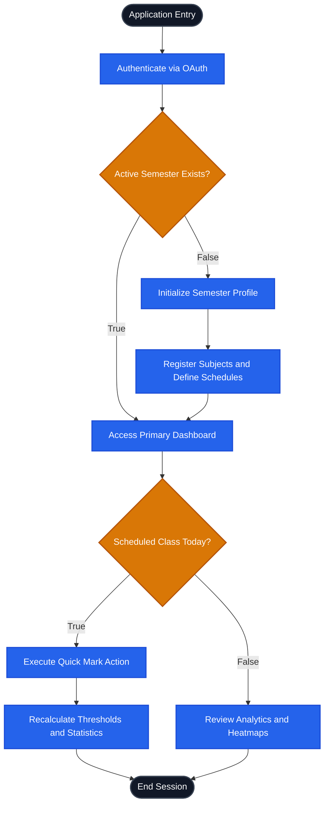
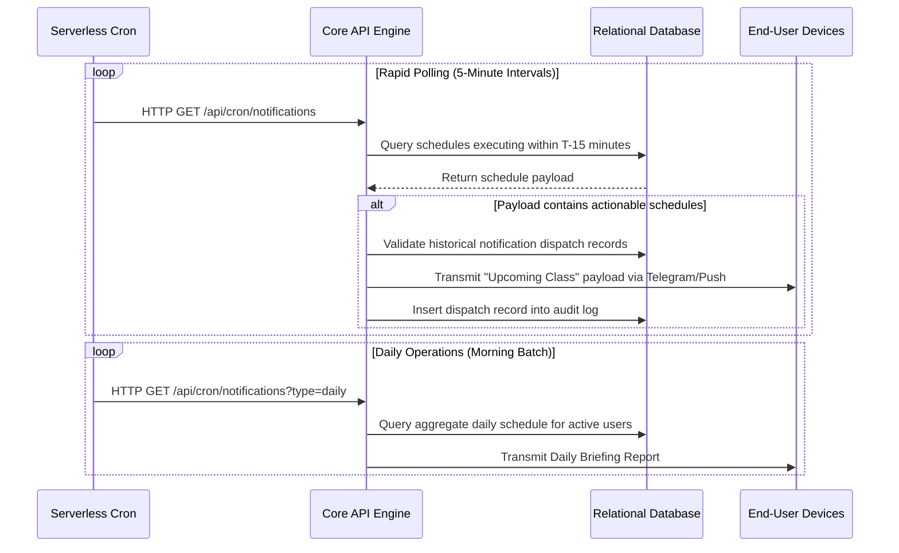

# AttendEase - Enterprise-Grade Attendance Tracking System


AttendEase is a highly scalable, production-ready attendance tracking application designed for academic and institutional environments. It leverages a modern technology stack to provide real-time analytics, automated notifications, and an intuitive user interface. 

---

## System Architecture

The application is built on a monolithic Next.js App Router architecture, ensuring seamless server-side rendering, robust API route handling, and strict type safety across the stack.



---

## Core Features and Capabilities

### 1. Dashboard and Subject Management
- **Centralized Dashboard**: A comprehensive daily overview displaying scheduled classes, immediate actionable modules (Quick Mark), statistical summaries, and dynamic danger alerts.
- **Subject Administration**: Support for color-coded subject categorization, complex recurring schedules, and archival/restoration processes.
- **Semester Management**: Multi-semester tracking, allowing users to transition between academic terms seamlessly while retaining historical data.

### 2. Attendance Tracking and Analytics
- **Precision Tracking**: Options to mark attendance states as Present, Absent, or Late. Features a robust audit log to track historical modifications.
- **Statistical Analytics**: Interactive SVG-based data visualizations, including bar charts, pie charts, and a contribution-style heatmap spanning the academic year.
- **Predictive Modeling (Simulator)**: A "what-if" computational engine that allows users to project the statistical impact of attending or missing future scheduled classes.
- **Deficit Calculator**: Computes exact thresholds for maximum permissible absences or the required consecutive classes needed to recover from a deficit.

### 3. Notification and Alerting Engine
- **Telegram Integration**: Leverages the Telegram Bot API to deliver zero-cost, unlimited pre-class alerts, attendance danger warnings, and comprehensive weekly reports directly to the user's device.
- **Email Dispatching**: Integrates with the Resend API to transmit clean, HTML-formatted daily briefings and weekly digests.
- **Native Browser Push**: Utilizes the Web Push API (VAPID) to send native, OS-level notifications to desktop and mobile clients.

### 4. User Interface and Experience
- **Progressive Web Application (PWA)**: Fully installable on iOS and Android devices, supporting offline capabilities and aggressive caching via Service Workers.
- **Design System**: Implements a sophisticated dark-mode glassmorphic aesthetic utilizing Tailwind CSS v4, featuring frosted glass panels, complex gradients, and hardware-accelerated micro-animations.

---

## User Workflow Diagram

The following flowchart illustrates the primary user journey, from initial authentication through daily interaction and data analysis.



---

## Background Task Architecture

The system utilizes serverless cron execution to handle asynchronous notification dispatching at scale.



---

## Technology Stack

| Layer | Technology |
|-------|-----------|
| **Application Framework** | Next.js 14 (App Router) + TypeScript |
| **Database** | PostgreSQL |
| **ORM** | Prisma |
| **Authentication** | NextAuth.js (Google, GitHub, Credentials) |
| **Styling Engine** | Tailwind CSS v4 |
| **External APIs**| Telegram Bot API, Resend Email API, Web Push (VAPID) |
| **Infrastructure** | Vercel (Hosting, Edge Functions, Cron Jobs) |

---

## Infrastructure Deployment

### Environment Variables Requirement Matrix

| Variable | Description |
|----------|-------------|
| `DATABASE_URL` | Fully qualified PostgreSQL connection string |
| `NEXTAUTH_SECRET` | Cryptographically secure 32+ character string |
| `NEXTAUTH_URL` | Canonical application URL |
| `GOOGLE_CLIENT_ID` | OAuth Client ID from Google Cloud Console |
| `GOOGLE_CLIENT_SECRET` | OAuth Client Secret from Google Cloud Console |
| `GITHUB_CLIENT_ID` | OAuth Client ID from GitHub Developer Settings |
| `GITHUB_CLIENT_SECRET` | OAuth Client Secret from GitHub Developer Settings |
| `TELEGRAM_BOT_TOKEN` | Bot authorization token generated via BotFather |
| `TELEGRAM_BOT_USERNAME` | Registered Telegram bot handle |
| `RESEND_API_KEY` | API Key generated from Resend Dashboard |
| `FROM_EMAIL` | Verified sender email address |
| `VAPID_PUBLIC_KEY` | Public key for Web Push Protocol generation |
| `VAPID_PRIVATE_KEY` | Private key for Web Push Protocol generation |
| `NEXT_PUBLIC_VAPID_PUBLIC_KEY` | Client-exposed Web Push public key |
| `CRON_SECRET` | Shared secret for cron job authentication |

### Local Development Initialization

```bash
# 1. Resolve package dependencies
npm install

# 2. Provision environment configuration
cp .env.example .env
# Ensure all variables defined in the matrix above are properly populated

# 3. Synchronize database schema and generate ORM client
npx prisma generate
npx prisma db push

# 4. Populate database with local testing fixtures
npx tsx prisma/seed.ts

# 5. Initialize local development server
npm run dev
```

The application will bind to port 3000. 

---

## License

**Copyright (c) 2026. All Rights Reserved.**

This software and associated documentation files (the "Software") are proprietary and confidential. 

Permission to use, copy, modify, and/or distribute this software for any purpose with or without fee is **strictly prohibited** without prior written permission from the repository owner. 

Any person or organization wishing to make changes, fork, deploy, or publish this software must obtain explicit, written authorization from the copyright holder.
