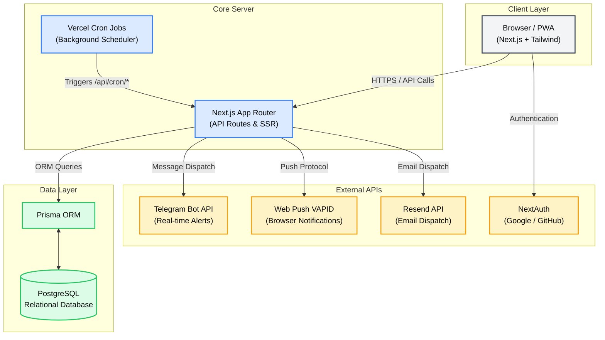
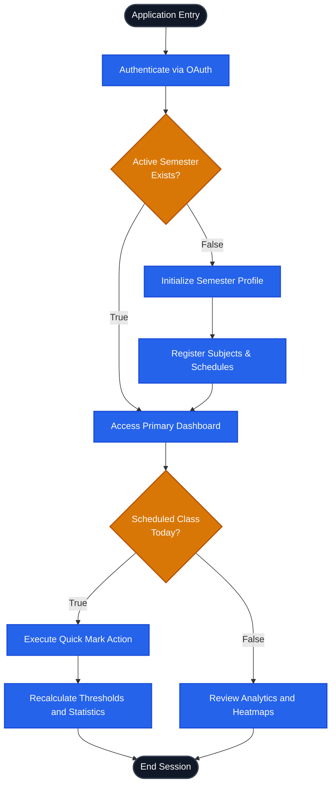
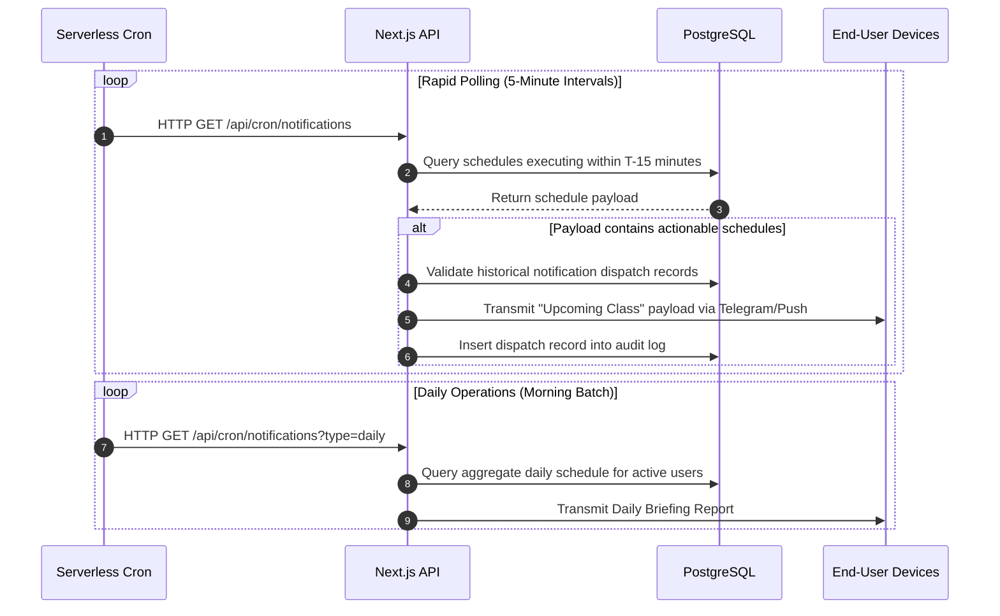

<div align="center">
  <h1> AttendEase — Smart Attendance Tracker</h1>
  <p>
    <b>A production-grade, full-stack attendance tracking platform with real-time analytics, automated Telegram/Push notifications, and predictive simulation capabilities.</b>
  </p>
  <p>
    <a href="https://attendease-c7wl.vercel.app">
      
    </a>
    <a href="LICENSE">
      
    </a>
  </p>

  <p>
    
    
    
    
    
    
    
    
    
    
    
    
    
    
    
    
    
    
    
  </p>
</div>

---

**AttendEase** is an enterprise-grade academic tracker built around three architectural pillars:

1.  **Monolithic Next.js Architecture** for seamless server-side rendering and strict end-to-end type safety.
2.  **Serverless Cron Jobs** for automated, background dispatching of daily briefs and pre-class alerts.
3.  **Comprehensive Predictive Analytics** utilizing a "What-If" simulator to project the impact of future attendance deficits.

The service is highly scalable, fully containerized, and surfaces a sophisticated dark-mode glassmorphic user interface.

---

## Table of Contents

1. [Key Features](#1-key-features)
2. [System Architecture](#2-system-architecture)
3. [Flow Diagrams](#3-flow-diagrams)
   - 3.1 [User Interaction Workflow](#31-user-interaction-workflow)
   - 3.2 [Background Notification Pipeline](#32-background-notification-pipeline)
4. [Database Schema](#4-database-schema)
5. [Quick Start — Local Development](#5-quick-start--local-development)
6. [Project Structure](#6-project-structure)
7. [Environment Configuration](#7-environment-configuration)
8. [Production Deployment Guide](#8-production-deployment-guide)
9. [License](#9-license)

---

## 1. Key Features

### Core capabilities
-  **Centralized Dashboard** — A comprehensive daily overview displaying scheduled classes and immediate actionable modules (Quick Mark).
-  **Subject Administration** — Support for color-coded subject categorization, complex recurring schedules, and archival/restoration processes.
-  **Semester Management** — Multi-semester tracking, allowing users to transition between academic terms seamlessly while retaining historical data.
-  **Precision Tracking** — Options to mark attendance states as Present, Absent, or Late, paired with a robust audit log to track historical modifications.
-  **Interactive Calendar** — Dedicated week and month views with color-coded status dots for at-a-glance historical attendance tracking.
-  **Data Import Engine** — Seamlessly import academic schedules and attendance history from Excel (`.xlsx`) or CSV files directly into the database.
-  **Gamification System** — Tracks attendance streaks, renders dynamic progress bars, and uses shimmer animations to encourage consistent attendance.
-  **AI Chatbot Assistant** — Integrated NLP-driven chatbot allowing natural language operations (e.g., "mark all present", "cancel my 9 AM class") powered by LLM models via OpenRouter.

### Engineering depth
-  **Predictive Modeling (Simulator)** — A "what-if" computational engine that allows users to project the statistical impact of attending or missing future scheduled classes.
-  **Deficit Calculator** — Computes exact thresholds for maximum permissible absences or the required consecutive classes needed to recover from a deficit.
-  **Telegram Integration** — Leverages the Telegram Bot API to deliver zero-cost, unlimited pre-class alerts, attendance danger warnings, and comprehensive weekly reports directly to the user's device.
-  **Native Browser Push** — Utilizes the Web Push API (VAPID) to send native, OS-level notifications to desktop and mobile clients.
-  **Progressive Web Application (PWA)** — Fully installable on iOS and Android devices, supporting offline capabilities and aggressive caching via Service Workers.

---

## 2. System Architecture



---

## 3. Flow Diagrams

### 3.1 User Interaction Workflow

Decision tree mapping the primary user journey from authentication to analytics.



### 3.2 Background Notification Pipeline

Asynchronous alert distribution utilizing serverless cron execution.



---

## 4. Database Schema

### Table: `User` (dimension)
| Column | Type | Notes |
| :--- | :--- | :--- |
| `id` | `cuid` | PK |
| `email` | `varchar` | Unique |
| `telegramChatId` | `varchar` | Used for bot integration |
| `timezone` | `varchar` | Default `Asia/Kolkata` |

### Table: `Subject` (dimension)
| Column | Type | Notes |
| :--- | :--- | :--- |
| `id` | `cuid` | PK |
| `minAttendancePct`| `float` | Used for calculating danger thresholds (e.g. 75.0) |
| `currentPercentage`| `float` | Cached current attendance percentage |
| `totalPresent` | `integer` | Aggregated cache of present classes |

### Table: `Schedule` (dimension)
| Column | Type | Notes |
| :--- | :--- | :--- |
| `id` | `cuid` | PK |
| `dayOfWeek` | `integer` | 0-6 representation |
| `startTime` | `varchar` | Standardized format (HH:MM) |

### Table: `AttendanceRecord` (fact)
| Column | Type | Notes |
| :--- | :--- | :--- |
| `id` | `cuid` | PK |
| `date` | `DateTime` | `db.Date` |
| `status` | `varchar` | Present, Absent, Late |
| `source` | `varchar` | e.g. "manual", "quick-mark" |

---

## 5. Quick Start — Local Development

```bash
# 1. Resolve package dependencies
npm install

# 2. Provision environment configuration
cp .env.example .env
# Ensure all variables are properly populated

# 3. Synchronize database schema and generate ORM client
npx prisma generate
npx prisma db push

# 4. Populate database with local testing fixtures
npx tsx prisma/seed.ts

# 5. Initialize local development server
npm run dev
```

The application will bind to `localhost:3000`.

---

## 6. Project Structure

```text
attendease/
├── prisma/                       # Database schema and seed files
├── public/                       # Static assets, Service Worker, Web Manifest
├── scripts/                      # Isolated utility, database, and debugging scripts
│   ├── automation/               
│   ├── database/                 
│   ├── debugging/                
│   ├── fixes/                    
│   ├── snapshots/                
│   └── testing/                  
├── src/                          # Next.js Application Root
│   ├── app/                      # App Router (Pages, API Routes, Layouts)
│   ├── components/               # React Components (UI, Forms, Charts)
│   ├── hooks/                    # Custom React Hooks
│   ├── lib/                      # Core logic, Prisma client, Server utilities
│   └── store/                    # Global state management
├── .env                          # Environment variables
├── next.config.mjs               # Next.js configuration
├── package.json                  # NPM manifest
├── prisma.config.ts              # Prisma CLI configuration
└── vercel.json                   # Vercel deployment and cron job configuration
```

---

## 7. Environment Configuration

Define the following within your `.env` file:

| Variable | Purpose |
| :--- | :--- |
| `DATABASE_URL` | Fully qualified PostgreSQL connection string |
| `NEXTAUTH_SECRET` | Cryptographically secure 32+ character string |
| `NEXTAUTH_URL` | Canonical application URL |
| `GOOGLE_CLIENT_ID` | OAuth Client ID from Google Cloud Console |
| `GOOGLE_CLIENT_SECRET` | OAuth Client Secret from Google Cloud Console |
| `GITHUB_CLIENT_ID` | OAuth Client ID from GitHub Developer Settings |
| `GITHUB_CLIENT_SECRET` | OAuth Client Secret from GitHub Developer Settings |
| `TELEGRAM_BOT_TOKEN` | Bot authorization token generated via BotFather |
| `TELEGRAM_BOT_USERNAME` | Registered Telegram bot handle |
| `RESEND_API_KEY` | API Key generated from Resend Dashboard |
| `FROM_EMAIL` | Verified sender email address |
| `VAPID_PUBLIC_KEY` | Public key for Web Push Protocol generation |
| `VAPID_PRIVATE_KEY` | Private key for Web Push Protocol generation |
| `NEXT_PUBLIC_VAPID_PUBLIC_KEY` | Client-exposed Web Push public key |
| `CRON_SECRET` | Shared secret for cron job authentication |

---

## 8. Production Deployment Guide

Deploying AttendEase requires provisioning PostgreSQL and configuring Vercel.

1. **Database Provisioning**: Instantiate a PostgreSQL database (e.g., Neon, Supabase). Obtain the connection string and assign it to `DATABASE_URL`.
2. **Push Protocol Keys**: Generate VAPID keys for browser notifications:
   ```bash
   npx web-push generate-vapid-keys
   ```
3. **Deployment**:
   ```bash
   npm i -g vercel
   vercel
   ```
4. **Environment Synchronization**: Ensure all variables listed in section 7 are applied within your Vercel project settings. The included `vercel.json` will automatically configure the background cron jobs.

---

## 9. License

**Copyright (c) 2026. All Rights Reserved.**

This software and associated documentation files (the "Software") are proprietary and confidential. 

Permission to use, copy, modify, and/or distribute this software for any purpose with or without fee is **strictly prohibited** without prior written permission from the repository owner. 

Any person or organization wishing to make changes, fork, deploy, or publish this software must obtain explicit, written authorization from the copyright holder.
