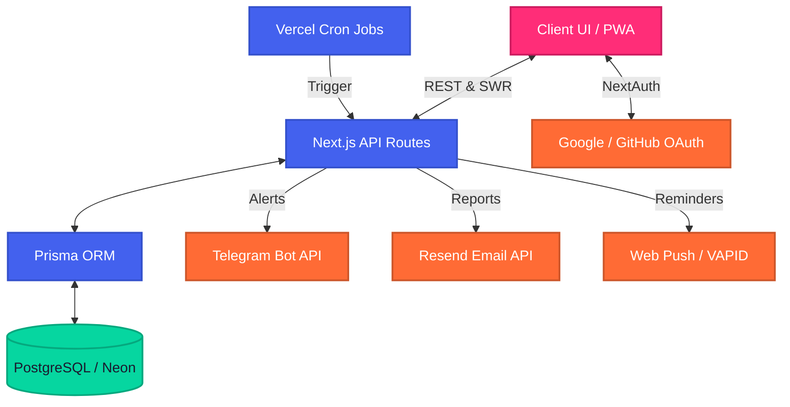
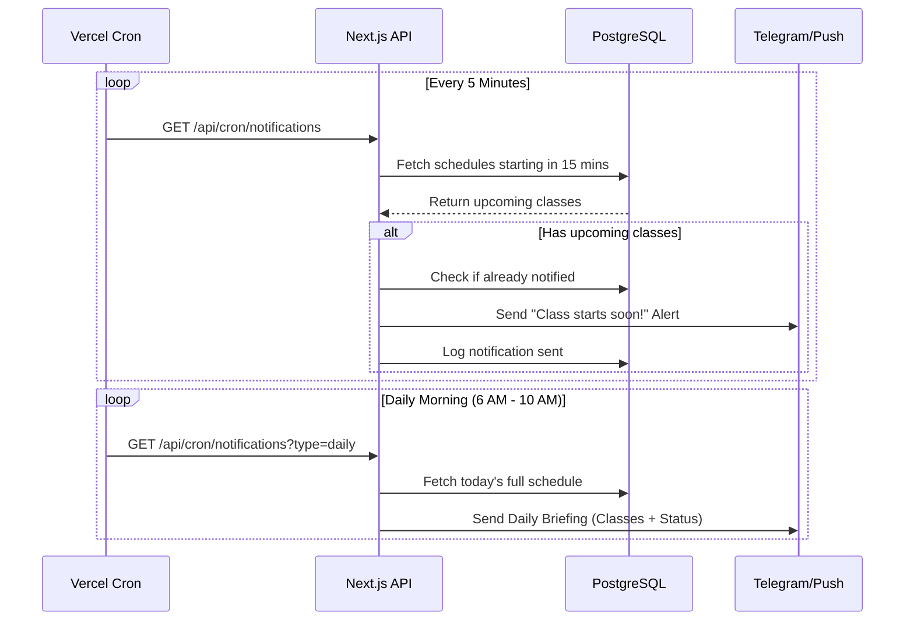

# AttendEase — Smart Attendance Tracker


A production-ready, full-stack attendance tracking app for students with glassmorphic UI, Telegram reminders, push notifications, Google/GitHub OAuth, and real-time analytics.

---

## 🏗 System Architecture

The application follows a modern monolithic architecture using Next.js App Router, backed by PostgreSQL and Prisma ORM.



---

## 🔄 User Workflow Flowchart

How a user interacts with AttendEase on a daily basis:

```mermaid
flowchart TD
    classDef start end fill:#1a1a2e,stroke:#4a4a5a,stroke-width:2px,color:#fff
    classDef process fill:#4361ee,stroke:#3451cc,stroke-width:2px,color:#fff
    classDef decision fill:#ff6b35,stroke:#cc5529,stroke-width:2px,color:#fff

    Start([Start]):::start --> Login[Sign in with OAuth]:::process
    Login --> HasSem{Has Semester?}:::decision
    
    HasSem -->|No| CreateSem[Create Semester]:::process
    CreateSem --> AddSub[Add Subjects & Schedules]:::process
    HasSem -->|Yes| Dash[View Dashboard]:::process
    AddSub --> Dash
    
    Dash --> Mark{Class Today?}:::decision
    Mark -->|Yes| QuickMark[Quick Mark Attendance]:::process
    QuickMark --> Calc[Bunk Calculator & Stats Update]:::process
    Calc --> End([End Session]):::start
    Mark -->|No| ViewAnalytics[View Analytics & Heatmap]:::process
    ViewAnalytics --> End
```

---

## 🔔 Background Notification Workflow

How background tasks and reminders are processed:



---

## 🚀 Quick Start (Local Development)

```bash
# 1. Install dependencies
npm install

# 2. Set up environment
cp .env.example .env
# Fill in your DATABASE_URL, NEXTAUTH_SECRET, and OAuth credentials

# 3. Generate Prisma client + push schema to database
npx prisma generate
npx prisma db push

# 4. Seed demo data
npx tsx prisma/seed.ts

# 5. Start dev server
npm run dev
```

Open [http://localhost:3000](http://localhost:3000) — demo login: **demo@attendease.app** / **password123**

---

## 🌍 Production Deployment (Vercel)

### 1. Database — Neon PostgreSQL (free)
1. Create account at [neon.tech](https://neon.tech)
2. Create a project → copy the connection string
3. Set `DATABASE_URL` in Vercel environment variables

### 2. Google OAuth
1. Go to [Google Cloud Console](https://console.cloud.google.com) → APIs & Services → Credentials
2. Create OAuth 2.0 Client ID (Web application)
3. Add authorized redirect URI: `https://your-domain.vercel.app/api/auth/callback/google`
4. Set `GOOGLE_CLIENT_ID` and `GOOGLE_CLIENT_SECRET`

### 3. GitHub OAuth
1. Go to [GitHub Developer Settings](https://github.com/settings/developers) → OAuth Apps → New
2. Set callback URL: `https://your-domain.vercel.app/api/auth/callback/github`
3. Set `GITHUB_CLIENT_ID` and `GITHUB_CLIENT_SECRET`

### 4. Telegram Bot
1. Message [@BotFather](https://t.me/BotFather) on Telegram → send `/newbot` → follow prompts to get token
2. Set bot webhook:
   ```bash
   curl -F "url=https://your-app.vercel.app/api/v1/telegram/connect" https://api.telegram.org/bot<TELEGRAM_BOT_TOKEN>/setWebhook
   ```
3. Set `TELEGRAM_BOT_TOKEN` and `TELEGRAM_BOT_USERNAME` in Vercel environment variables

### 5. Email Notifications (Resend)
1. Create account at [resend.com](https://resend.com)
2. Get API key from dashboard
3. Set `RESEND_API_KEY` and `FROM_EMAIL` (e.g. `AttendEase <onboarding@resend.dev>`) in Vercel environment variables

### 6. Push Notifications
```bash
npx web-push generate-vapid-keys
```
Set both `VAPID_PUBLIC_KEY`, `VAPID_PRIVATE_KEY`, `VAPID_CONTACT_EMAIL`, and `NEXT_PUBLIC_VAPID_PUBLIC_KEY` (same as VAPID_PUBLIC_KEY)

### 7. Deploy to Vercel
```bash
npm i -g vercel
vercel
```

Set all environment variables in Vercel dashboard. The `vercel.json` configures cron jobs for:
- Pre-class reminders (every 5 min)
- Daily morning brief (6-10 AM, Mon-Sat)
- Weekly report (Sunday 10 AM)

---

## 🛠 Required Environment Variables

| Variable | Description |
|----------|-------------|
| `DATABASE_URL` | PostgreSQL connection string |
| `NEXTAUTH_SECRET` | Random 32+ char string |
| `NEXTAUTH_URL` | Your app URL |
| `GOOGLE_CLIENT_ID` | Google OAuth client ID |
| `GOOGLE_CLIENT_SECRET` | Google OAuth secret |
| `GITHUB_CLIENT_ID` | GitHub OAuth client ID |
| `GITHUB_CLIENT_SECRET` | GitHub OAuth secret |
| `TELEGRAM_BOT_TOKEN` | Telegram bot token from BotFather |
| `TELEGRAM_BOT_USERNAME` | Telegram bot username |
| `RESEND_API_KEY` | Resend API key |
| `FROM_EMAIL` | Sender email address |
| `VAPID_PUBLIC_KEY` | Web Push public key |
| `VAPID_PRIVATE_KEY` | Web Push private key |
| `NEXT_PUBLIC_VAPID_PUBLIC_KEY` | Same as VAPID_PUBLIC_KEY |
| `CRON_SECRET` | Secret for cron job auth |

---

## ✨ Features

- **Dashboard** — Today's classes with quick mark, stats cards, danger alerts
- **Subject Management** — Color-coded subjects, schedules, archive/restore
- **Attendance Tracking** — Present/absent/late, bulk marking, audit log
- **Bunk Calculator** — How many classes you can skip or need to recover
- **Analytics** — Custom SVG bar/pie charts, GitHub-style heatmap
- **What-If Simulator** — See impact of skipping/attending classes
- **Calendar** — Week and month views with status dots
- **Telegram Reminders** — Free, unlimited pre-class alerts, danger warnings, daily briefs & weekly reports
- **Email Notifications** — Clean HTML email reports via Resend
- **Push Notifications** — Browser push via Web Push API
- **Google/GitHub OAuth** — One-click social login
- **Semester Management** — Multiple semesters with switch
- **Gamification** — Streaks, progress bars, and shimmer animations
- **PWA** — Installable mobile app, offline support
- **Glassmorphic UI** — State-of-the-art dark theme with frosted glass, vibrant gradients, and CSS micro-animations

---

## 💻 Tech Stack

| Layer | Technology |
|-------|-----------|
| **Framework** | Next.js 14 (App Router) + TypeScript |
| **Database** | PostgreSQL via Prisma ORM |
| **Auth** | NextAuth.js (Google, GitHub, Credentials) |
| **Styling** | Tailwind CSS v4, Glassmorphism, Micro-animations |
| **Integrations**| Telegram Bot API, Resend Email API, Web Push (VAPID) |
| **Deployment** | Vercel (with Serverless Cron Jobs) |

---

## 📜 License
MIT License
